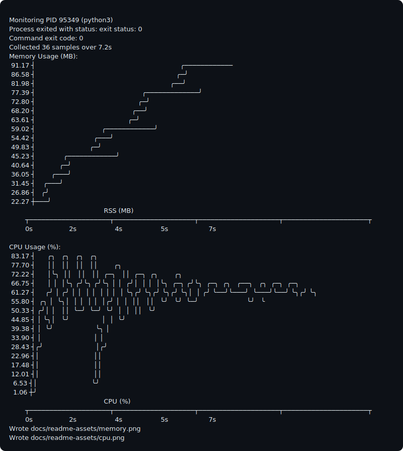
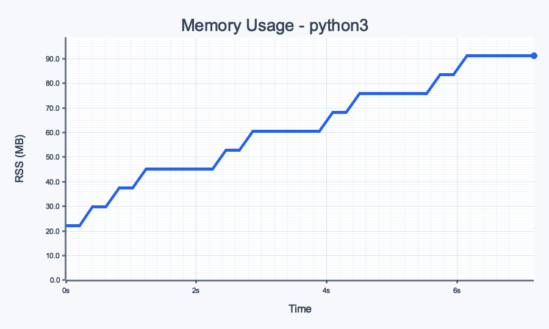
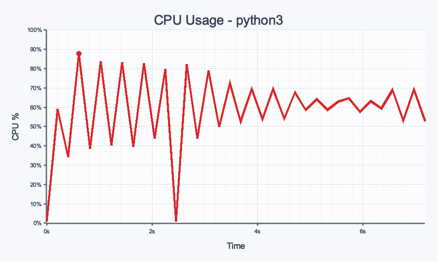

# psrecord

Small CLI to run a command, sample its memory/CPU usage, and generate graphs.

## What it does

- Runs your command and monitors RSS + CPU over time.
- Prints ASCII graphs to `stdout` by default.
- Can write `PNG` and/or `SVG` graphs to an output directory.
- Returns the wrapped command's exit code.

## Usage

```bash
cargo run -- -- <command> [args...]
```

Modes (`-m/--mode`) control where graphs go:

- `terminal` (or `term`): ASCII graphs to stdout. Default when no mode is passed.
- `png`: write `memory.png` and `cpu.png`.
- `svg`: write `memory.svg` and `cpu.svg`.
- Repeat `--mode` to combine outputs.

If `png` or `svg` mode is enabled and `--output` is not provided, output files are written to `psr-<command>-<timestamp>`.

Examples:

```bash
# default mode is terminal (ASCII output)
cargo run -- -- python3 -c "import time; x=bytearray(100_000_000); time.sleep(2)"

# PNG output only
cargo run -- --mode png --output out -- sleep 2

# terminal + SVG output
cargo run -- --mode terminal --mode svg --output out -- sleep 3

# PNG + SVG with custom interval/image size
cargo run -- --mode png --mode svg --interval 200 --output out --width 1280 --height 720 -- sleep 3
```

## Output preview

Command used to generate the sample output below:

```bash
target/debug/psrecord --mode terminal --mode png --interval 200 --output docs/readme-assets --width 900 --height 540 -- python3 -c 'import math,time; blocks=[]; acc=0.0
for step in range(18):
    buf=bytearray(8_000_000)
    for i in range(0, len(buf), 4096):
        buf[i]=step%251
    blocks.append(buf)
    end=time.time()+0.25
    while time.time()<end:
        for i in range(1,3000):
            acc += math.sqrt((i*step)%997+1)
    time.sleep(0.15)
    if step%4==3 and len(blocks)>2:
        del blocks[:2]'
```

Terminal output:



Raw terminal text: `docs/readme-assets/terminal-output.txt`

Rendered PNG output:




## Memory scale behavior

Memory graphs auto-select one unit per run based on peak RSS:

- `< 1 MiB` -> `KB`
- `< 1 GiB` -> `MB`
- `< 1 TiB` -> `GB`
- `>= 1 TiB` -> `TB`

The same unit is used for terminal, PNG, and SVG memory graphs.

## Platform prerequisites

`psrecord` image modes (`png` and `svg`) render chart text via `plotters`, which may require native font libraries on Unix-like systems.

### Linux (Ubuntu/Debian)

Install build tools and font dependencies:

```bash
sudo apt update
sudo apt install -y build-essential pkg-config libfontconfig1-dev libfreetype6-dev fontconfig fonts-dejavu-core
```

Optional sanity checks:

```bash
pkg-config --modversion fontconfig
pkg-config --modversion freetype2
```

### macOS (Homebrew)

Install required dependencies:

```bash
brew install pkgconf fontconfig freetype
```

Optional sanity checks:

```bash
pkg-config --modversion fontconfig
pkg-config --modversion freetype2
```

## Development

```bash
cargo +nightly fmt --all
cargo clippy --all-targets --all-features
cargo test
```

## License

Apache License 2.0. See `LICENSE`.
